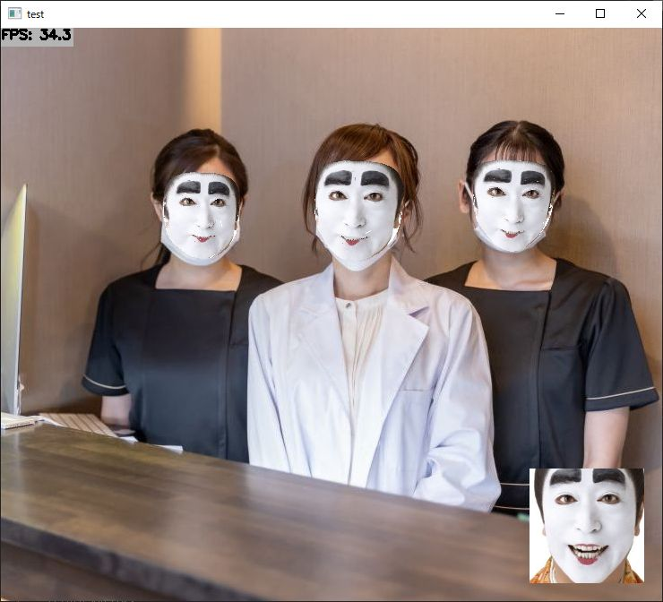
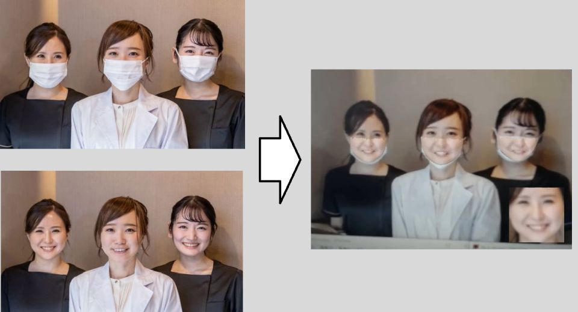

https://user-images.githubusercontent.com/11009876/134674223-490af2c8-499b-40b2-a147-76b58f048dd6.mp4

# Aiine Transform (アイン変換)
Swapping face using FaceMesh. (could be used to unveil masked faces)




# Tested Environment
## Computer
- Windows 10 (x64) + Visual Studio 2019
    - Intel Core i7-6700 @ 3.4GHz
- It's not tested, but this project should run on Linux (x64, aarch64)

## Deep Learning Inference Framework
- TensorFlow Lite with XNNPACK delegate

# How to Build and Run
## Requirements
- OpenCV 4.x
- CMake

## Download 
- Get source code
    - If you use Windows, you can use Git Bash
    ```sh
    git clone https://github.com/iwatake2222/aiine_transform.git
    cd aiine_transform
    git submodule update --init --recursive --recommend-shallow --depth 1
    cd inference_helper/third_party/tensorflow
    chmod +x tensorflow/lite/tools/make/download_dependencies.sh
    tensorflow/lite/tools/make/download_dependencies.sh
    ```
- Download prebuilt library
    - Please find `third_party.zip` in https://github.com/iwatake2222/InferenceHelper/releases/
    - Extract it to `inference_helper/third_party/`
        - The prebuilt library will be placed at `inference_helper/third_party/ooo_prebuilt`

## Windows (Visual Studio)
- Configure and Generate a new project using cmake-gui for Visual Studio 2019 64-bit
    - `Where is the source code` : path-to-cloned-folder
    - `Where to build the binaries` : path-to-build	(any)
- Open `main.sln`
- Set `main` project as a startup project, then build and run!
- Note:
    - Running with `Debug` causes exception, so use `Release` or `RelWithDebInfo` if you use TensorFlow Lite
    - You may need to modify cmake setting for TensorRT for your environment

## Linux
```sh
mkdir build && cd build
cmake ..
make
./main
```

## Usage
```
./main [input]
 - input:
    - use the default image file set in source code (main.cpp): blank
        - ./main
     - use video file: *.mp4, *.avi, *.webm
        - ./main test.mp4
     - use image file: *.jpg, *.png, *.bmp
        - ./main test.jpg
    - use camera: number (e.g. 0, 1, 2, ...)
        - ./main 0
    - use camera via gstreamer on Jetson: jetson
        - ./main jetson
```

## Control
- '0' key: Change masking mode
- '1' key: Switch main image
- 'f' key: Capture face image
- 'g' key: Read face image


# Model Information
## Details
- Face Detection
    - BlazeFace
    - https://github.com/PINTO0309/PINTO_model_zoo/blob/main/030_BlazeFace/01_float32/download.sh
    - https://github.com/PINTO0309/PINTO_model_zoo/blob/main/030_BlazeFace/01_float32/download_new.sh
    - https://github.com/google/mediapipe/tree/master/mediapipe/models
- FaceMesh
    - FaceMesh
    - https://github.com/PINTO0309/PINTO_model_zoo/blob/main/032_FaceMesh/01_float32/download.sh
    - https://github.com/google/mediapipe/tree/master/mediapipe/models#face-mesh


# License
- Copyright 2021 iwatake2222
- Licensed under the Apache License, Version 2.0
    - [LICENSE](LICENSE)


# Acknowledgements
I utilized the following OSS in this project. I appreciate your great works, thank you very much.

## Code, Library
- TensorFlow
    - https://github.com/tensorflow/tensorflow
    - Copyright 2019 The TensorFlow Authors
    - Licensed under the Apache License, Version 2.0
    - Generated pre-built library

## Model
- PINTO_model_zoo
    - https://github.com/PINTO0309/PINTO_model_zoo
    - Copyright (c) 2019 Katsuya Hyodo
    - Licensed under the MIT License (MIT)
    - Copied converted model files
- MediaPipe
    - https://github.com/google/mediapipe
    - Copyright 2020-2021 The MediaPipe Authors.
    - Licensed under the Apache License, Version 2.0

## Special thanks
- tflite_gles_app
   - https://github.com/terryky/tflite_gles_app
   - Copyright (c) 2019 terryky
   - Licensed under the MIT License
   - Got inspiration and the original idea

## Image Files
- Bakatono
    - https://stat.ameba.jp/user_images/20180329/04/kituonnbo-karu/27/f7/j/o1078150014159190922.jpg
    - https://ameblo.jp/kituonnbo-karu/entry-12364059792.html
- Face images
    - https://www.photo-ac.com/
